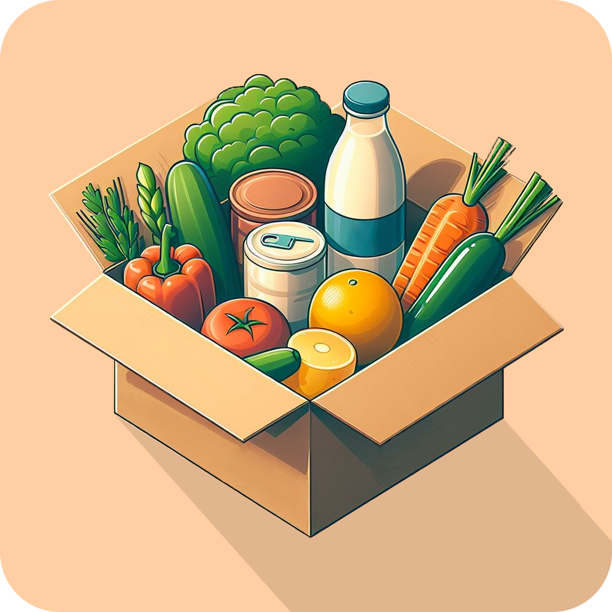

<h1 align="center" line-height:1"><b>Grocery Genius</b></h1>

  

<h3 align="center" line-height:1"><b>Grocery Genius is now a CRUD 🎉, 1st release coming in a few days</b></h3>

 

Grocery Genius is a reliable Android app for your grocery needs, where you can add, edit, and delete items with the finesse of a ninja. And we’re gearing up to introduce real-time sharing! Soon, you’ll be able to sync your shopping lists with friends and family as you go. Apart from that, Grocery Genius offers a visually appealing interface featuring grocery images, autocomplete suggestions, and an intuitive user experience.

## Motivation

My motivation for this project is to learn how to talk to the server effectively and implement the functionality of live data sharing while preserving the offline-first mode, which is known to be tricky for many mobile devs. Additionally, it will add another non-traditional project to my portfolio and allow me to practice the Android tech stack. 

## Features

- Easily create and sort your grocery lists
- Use already available products instead of typing the name of each or create your own items
- ~~See which products are in stock, which products will be over soon, and which ones have already run out.~~ Discontinued, may be introduced in the future but the main focus has shifted to shopping list sharing.
- Modern Material UI with customizability options such as item sorting, dark/light mode, etc.

## Tech stack

- Jetpack Compose for the user interface, with a single Activity and no Fragments.
- View model for business logic separation
- Room database for local data storage
- Kotlin coroutines and flow for asynchronous requests
- Hilt for dependency injection
- MVVM pattern but with intents from MVI
- CLEAN architecture with both repository and use cases
- SOLID principles
