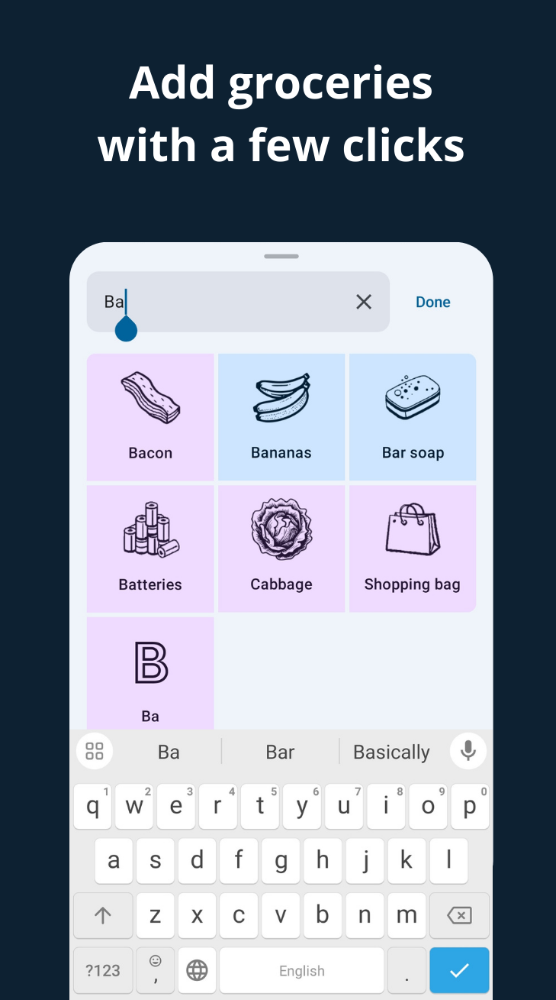

<h1 align="center" style="font-size:28px; line-height:1"><b>Grocery Genius</b></h1>

  

 

  

 
 

|                                                 |                                               |                                              |
|-------------------------------------------------|-----------------------------------------------|----------------------------------------------|
|  |  |  |

Grocery Genius is a free, customizable shopping list app with a modern design, autocomplete suggestions, offline capabilities, and feature-rich functionality.

## Features

- **Add groceries with a few clicks.** The app has a database of over 130 predefined groceries, each with its own icon. Type as few as two letters, and the best matching items will quickly appear.
- **Add, Edit, and Delete Groceries.** If your grocery item isn’t in the database, it will be created automatically. You can then categorize it, assign an icon, remove it from the list, or delete it entirely.
- **Modern Design.** Unlike many shopping list apps that use a list view, Grocery Genius features a grid view with attractive icons and color-coded separation for purchased and unpurchased items. Groceries are sorted by category, mirroring their placement in stores. The app’s design follows Material You practices, offering dynamic color, dark and light modes, and six color schemes to choose from.
- **Manage Separate Lists.** Create multiple grocery lists and easily reorder them on the main screen with drag-and-drop functionality.
- **Customization.**: You can choose a default grocery list, reorder categories, switch between dark and light modes, and choose a different color scheme in the settings.
- **Offline Mode.** Initially, the app requires an internet connection to fetch predefined groceries. After that, you can use it fully offline.
- **Completely Free.** Grocery Genius is free and open source, with no limitations. Add as many grocery lists as you want. All features available now will remain free forever.

## Roadmap

These features may or may not be implemented in the long term.
- Sharing grocery lists with other people
- Location reminders
- Adding photos to items
- Adding items using voice

## Get the app

You can install the app from the [GitHub releases](https://github.com/DanielRendox/GroceryGenius/releases) page or build it yourself by [cloning the project](https://docs.github.com/articles/cloning-a-repository) and launching it in the latest version of [Android Studio](https://developer.android.com/studio).

## Tech stack

- Jetpack Compose for the user interface, with a single Activity and no Fragments
- Room database for local data storage
- Retrofit for working with REST API
- Kotlin coroutines and flow for asynchronous requests
- Hilt for dependency injection
- Work Manager for synching data in the background
- RecyclerView for lists with drag-and-drop functionality
- MVI pattern
- CLEAN architecture data and presentation layer
